
<h1 align="center">基于Java的汽车客运站管理系统的设计与实现</h1>

## 简介
汽车客运站管理系统：角色分为管理员和用户；功能包括车辆管理、售票管理、车辆调度管理、系统公告管理、财务统计和用户个人中心，提升客运站管理效率和服务质量。    --计算机毕业设计源码；毕设源码；java毕业设计源码

## 联系方式

<h3 align="center">获取完整代码与数据库文件 + 微信：deepguan QQ: 86050149 QQ群: 783742310</h3>

<h3 align="center">可帮忙远程部署 包运行成功！提供远程部署、修改代码、设计文档指导、代码讲解等服务！</h3>

## 功能介绍（完整见运行截图）
管理员：提供管理个人信息、车辆、车票及系统公告的功能，包括登录、注册及账户维护。能够添加、修改及删除管理员及车辆信息；进行车辆调度管理，查看车辆列表及车票销售数据。可通过简洁的界面操作售票管理，调取财务及业务的统计信息并展示。在公告管理模块创建、编辑及删除公告。

车辆管理员：负责管理车辆相关信息，包括车辆的添加、修改、删除和调度。可查看详细的车辆列表，包括车牌号码、司机、车型、始发站、终点站、票价等。管理车辆调度信息，安排班次，更新车票金额信息，保持车辆运营数据清晰准确。

售票员：负责购票及票务管理，包括售票信息录入、售票查询及检票工作。可通过界面操作添加、查看、修改或删除售票记录，确保票务统计的准确性。能够通过可视化图表，直观了解票务销售比例，决定售票政策。

用户：访问车辆查询、票务浏览、公告阅读等功能模块。通过系统首页及导航栏，获取当前班次、票价及始发和终点站信息。个人可进行登录、注册操作，查看公告内容及公告创建时间。

## 运行截图
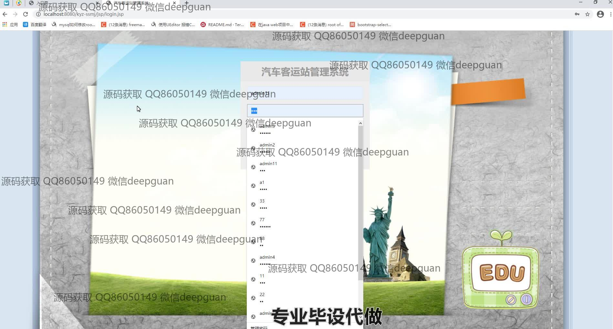
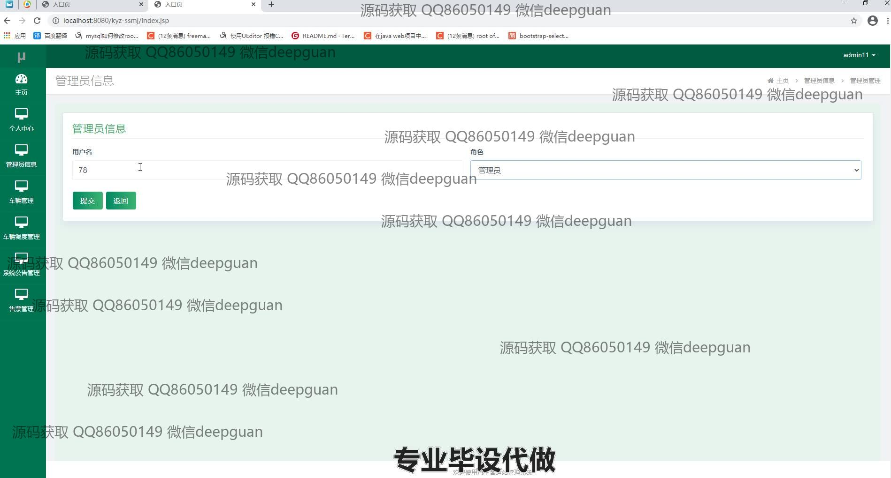
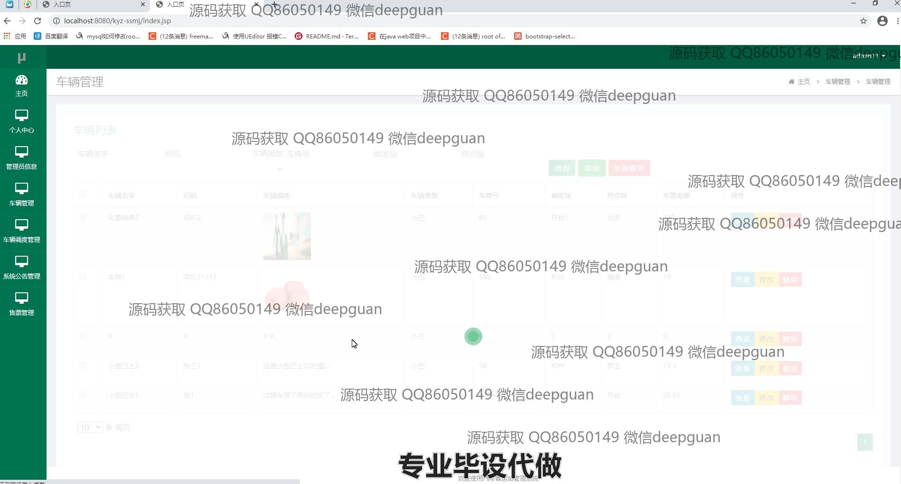
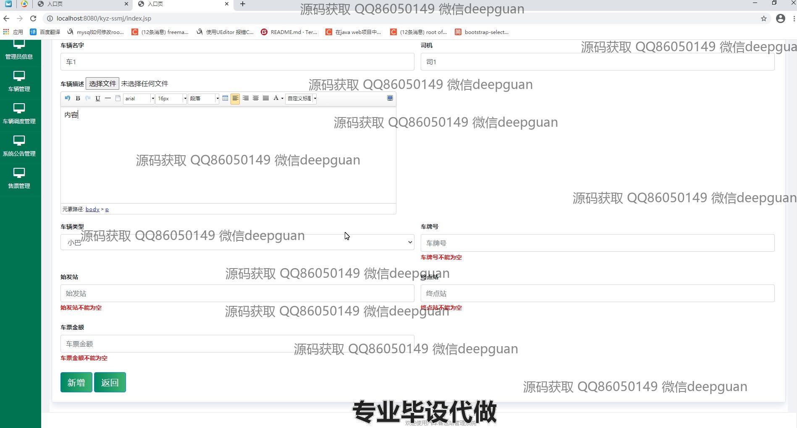
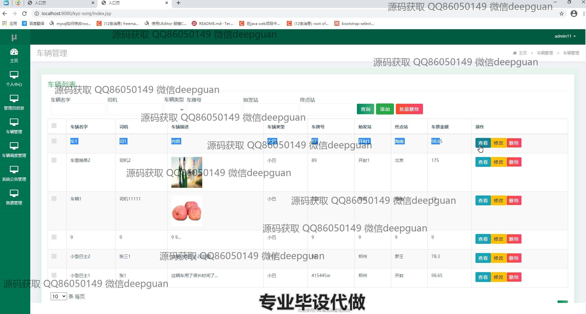
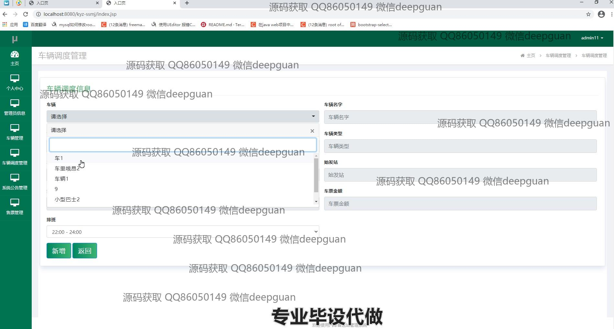
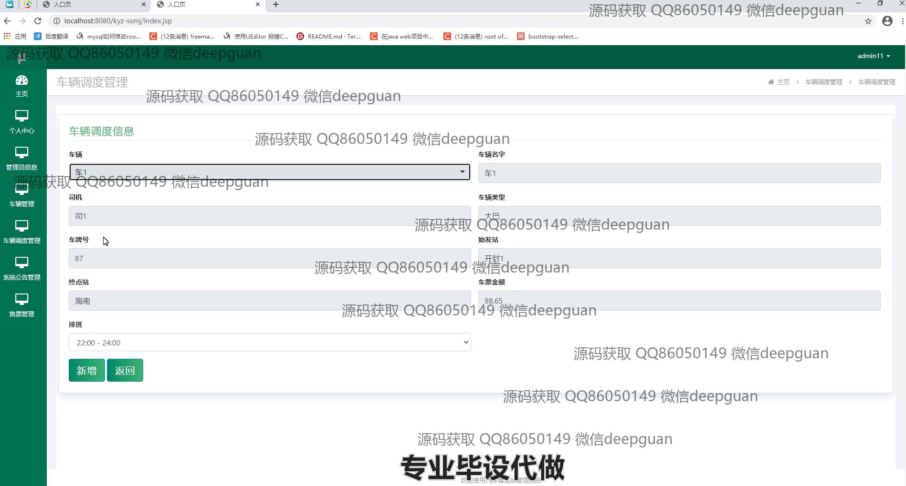
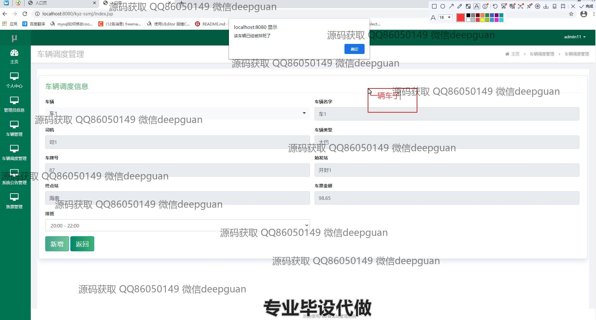

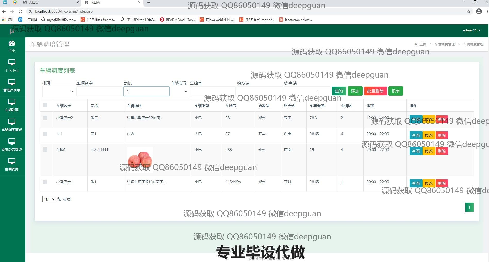
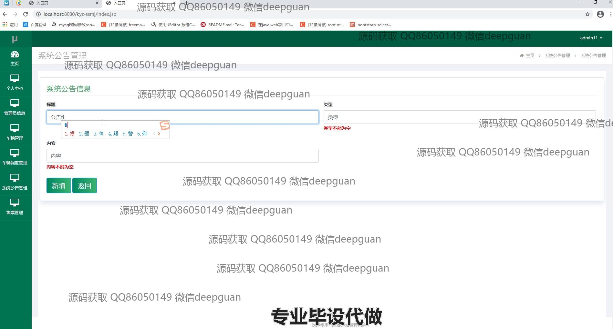
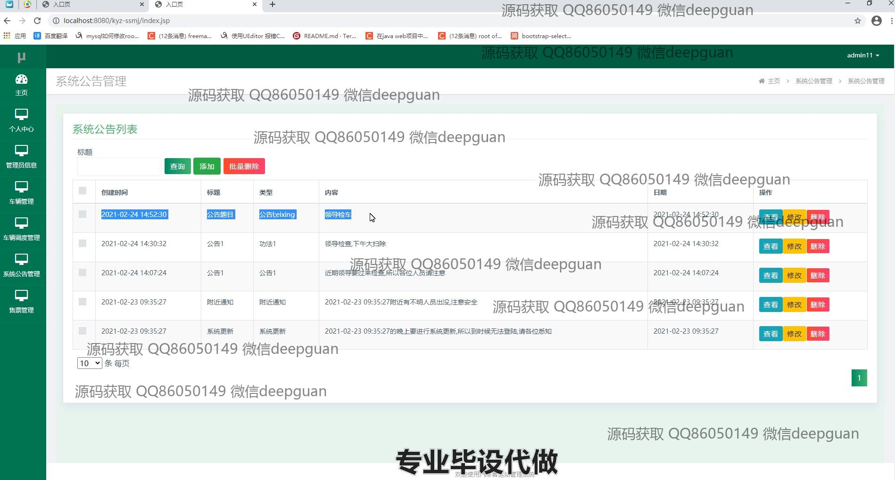
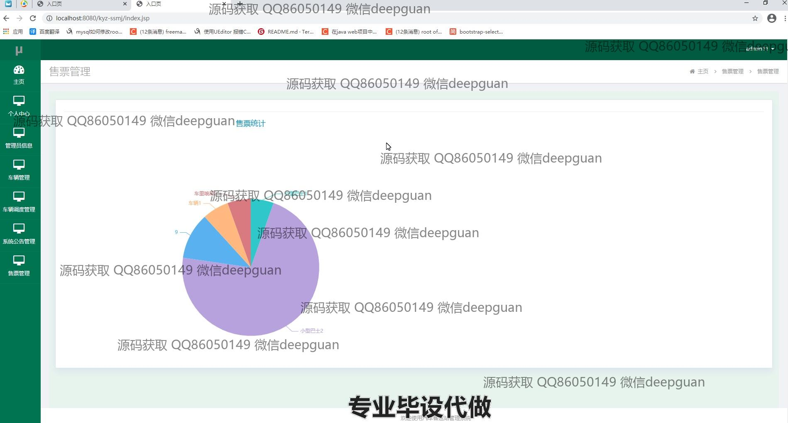
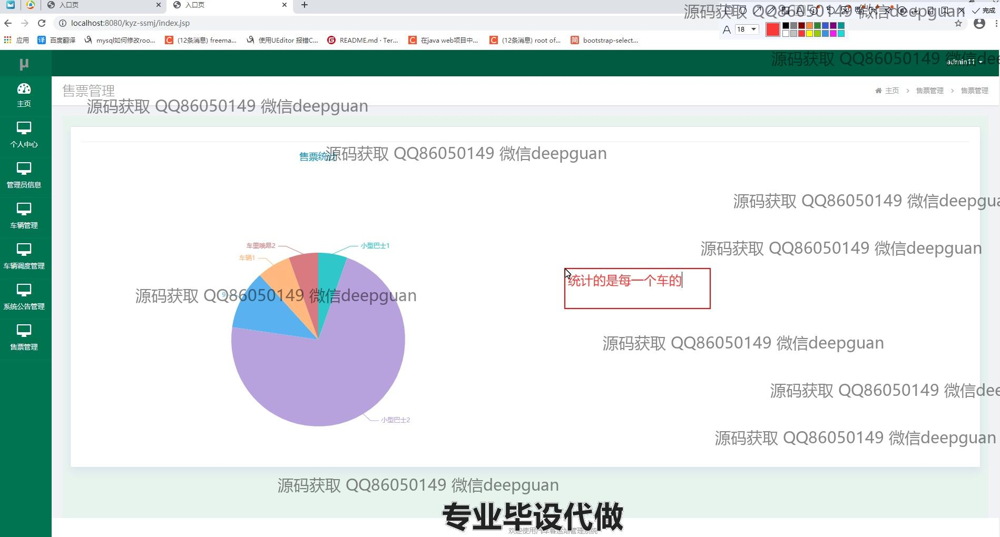

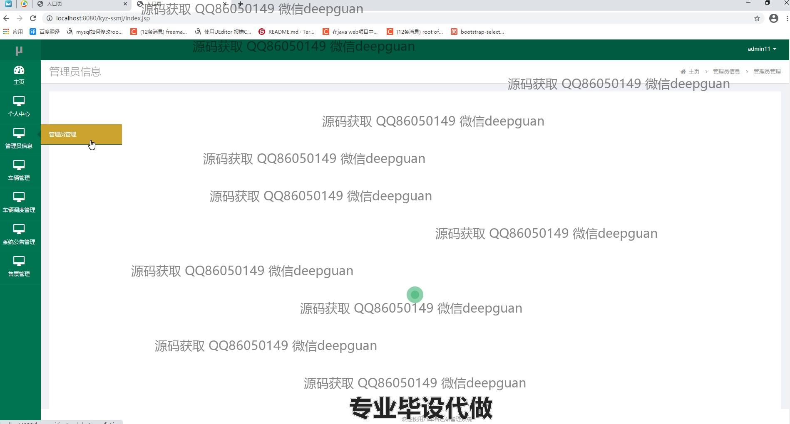
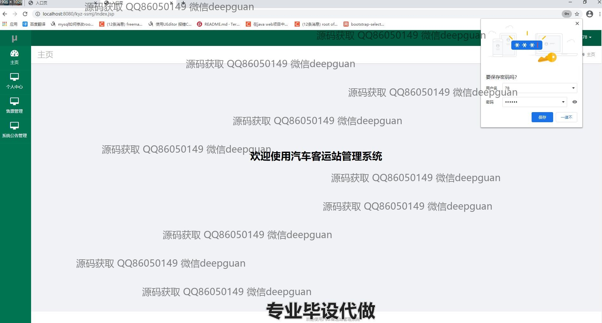
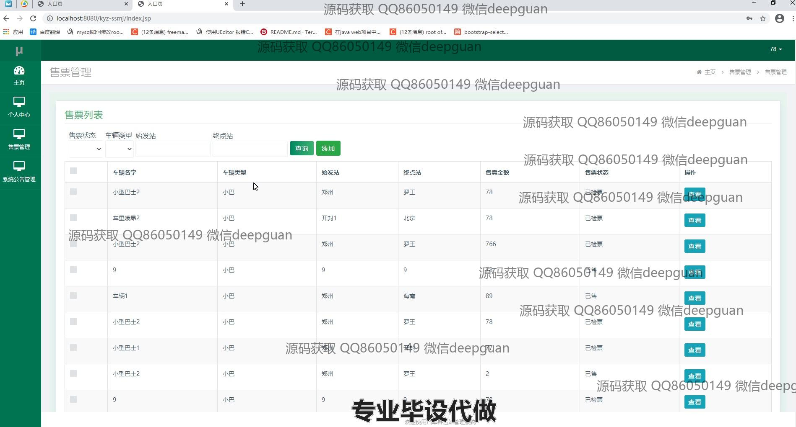
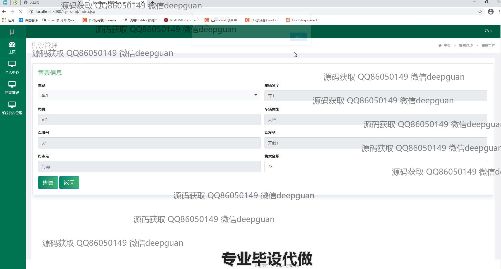
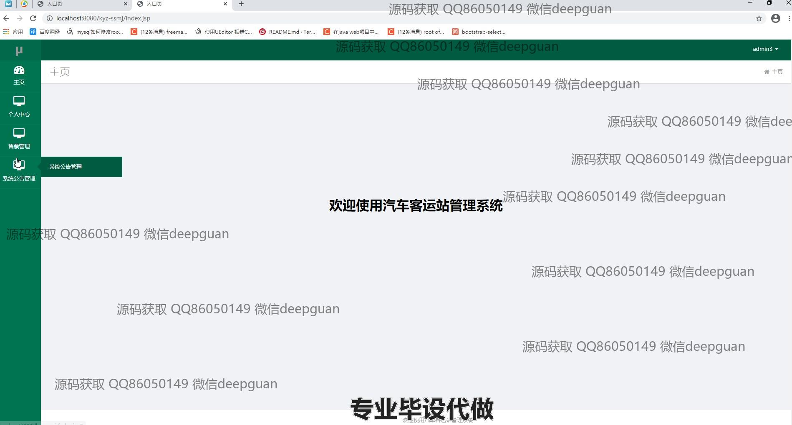
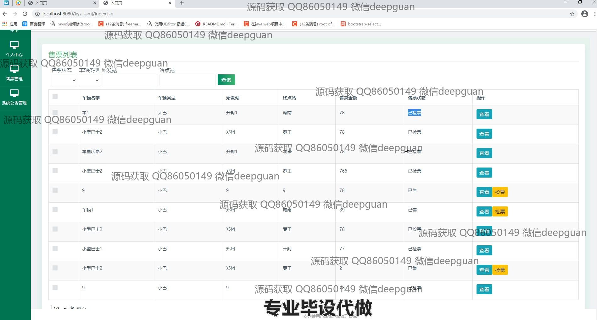

本代码来源于网络,仅供学习参考使用!

